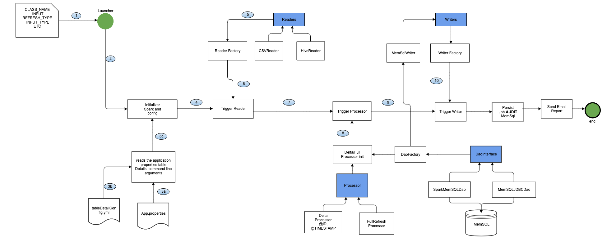
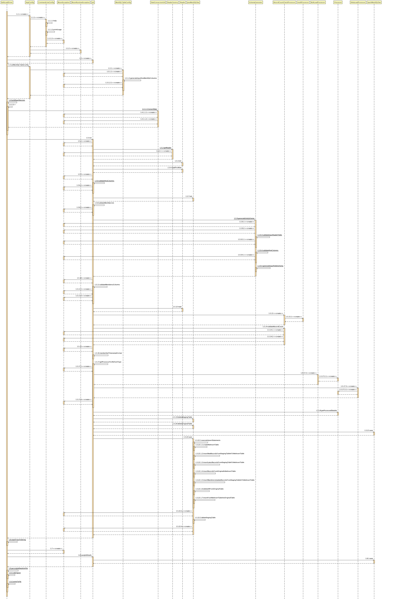

## Get Started - Launch BLooM

#### build code
- Download code / fork the repo
- Do a maven build and generate tar file

#### Untar binary
    cd /app/bloom/INSTALL
    tar -xvf bloom-core-1.0.0-SNAPSHOT-dist.tar

#### Create symlink for installation - optional
    ln -s /app/bloom/INSTALL/bloom-core-2.0.0-SNAPSHOT bloom

#### Considerations
1. In case input is a CSV file, it should have proper column headers which should match MemSQL column names. 
2. The order of the header names need not be same to the MemSQL table column order. 
3. CSV can have data related to a few columns or all the columns.
3. For the MemSQL table where the data has to be loaded, it is mandatory to have a last updated timestamp column as its used to run job in Update/Upsert mode.
4. It supports all the data types for MemSQL. While configuring the data types in MemSQL, the user should check whether the incoming data size is greater than the size of the configured data type, if so, MemSQL will downcast it to the closest value.
5. The input csv file should have unique record for all primary key(s).
6. Note that for Columnstore tables, it is mandatory to have a staging table if running in upsert mode. The incoming data is first loaded in the staging table, which is then used for comparison with the existing data to come up with the net insert data, which is finally written back to the original table.

#### How to Configure: 
1. Edit the tableDetailsConfig.yml file inside the conf directory to add the MemSQL table details. 
```yaml
tableDetails:
 - tableName: "account_columnstore"
   columnNames: "account_id,user_id,date_key,hier_level,ytd_spend,lastmodifieddate,auto_inc_id"
   primaryKeyColumnNames: "account_id,date_key"
   timestampColumnName: "lastmodifieddate"
   autogeneratedColumnNames: "auto_inc_id"
```
   
2. For Hive ingestion using BLM, add the hiveMemSQLColumnsMapping (mandatory):
```yaml
tableDetails:
 - tableName: "account_columnstore"
   columnNames: "account_id,user_id,date_key,hier_level,ytd_spend,lastmodifieddate,auto_inc_id"
   primaryKeyColumnNames: "account_id,date_key"
   timestampColumnName: "lastmodifieddate"
   autogeneratedColumnNames: "auto_inc_id"
   hiveMemSQLColumnsMapping: "acct_id:account_id,org_code:org_cd,last_modified_date:last_modified_date"
   hiveLoadAppendTimestampColumn: "feed_key"
```
  
3. hiveMemSQLColumnsMapping represents the mapping of Hive columns to MemSQL columns and hiveLoadAppendTimestampColumn represents timestamp column present in Hive table to track new record insert timestamp into hive

4. The bloom.properties file also contains a property named blaze.bloom.csv.delimter which needs to be set based on the delimiter(‘/u0001’,‘,’) of the incoming data.

5. There are two BloomSparkHigh.conf and BloomSparkLow.conf inside the conf directory which have the spark configurations, it is used for large size file and small size file processing on Spark cluster.

6. We can edit these files to change the spark configuration like number of executors,memory,queue etc..

7. Finally, in case we want to run the job for a single file execute it as shown below:
  
#### Execute

    <bloom_HOME>/bin/BLooMLauncher.sh  
    
    usage: bloom
     -tn,--tableName <arg>   It should be the name of the table where the data has to be loaded
     -h,--help                     Show Help.
     -ip,--input <arg>             Directory location of input data file 
     -it,--inputType <arg>         This indictes the type of file like csv,hive table etc..
     -rt,--refreshType <arg>       This indicates the type of load - FULL_REFRESH, UPSERT, LOAD-APPEND
     -tt,--tableType <arg>         This indicates type of table - rowstore / columnstore (reference is also treated as rowstore)
     -ar,--archival <Boolean>      This indicates if archival of csv files is needed or not

#### For Full-REFRESH

    /app/bloom/INSTALL/bloom/bin/BLooMLauncher.sh \ or bloom
        -tn account_fact  \
        -ip /staging/AccountMaster.csv \
        -rt Full-REFRESH \
        -it csv
        -tt rowstore
        -ar true

#### For UPSERT

    /app/bloom/INSTALL/bloom/bin/BLooMLauncher.sh \ 
        -tn account_fact  \
        -ip /staging/AccountMaster.csv \
        -rt UPSERT \
        -it csv
        -tt rowstore
        -ar true

#### For processing multiple files from a directory

    /app/bloom/INSTALL/bloom/bin/BLooMFileProcess.sh \
    -tn account_fact  \
    -ip /warehouse/bloom/job/input/ \
    -rt Full-REFRESH \
    -tt rowstore
    -it csv
    -ar true
    
#### For Hive as the source type:    

    /app/bloom/INSTALL/bloom/bin/BLooMLauncher.sh \
    -tn account_fact  \
    -ip hive_dbname.hive_tablename   \
    -rt Full-REFRESH \
    -tt rowstore
    -it hive
    
#### Post Processing

- Once the file is successfully processed , it is renamed by appending “PROCESSED” and current time stamp and archived to the archival directory.
- And if file fails to be processed successfully, then, it is renamed by appending “FAILED” and current time stamp and archived to the archival directory.
- The Audit of all the Bloom job gets saved in the bloom_job_history table    

#### Audit Tracking

- MBL job updates the jobs history in the bloom_job_history table and can track input file count, table records loaded count, total time etc.

- Below are the details captured in the bloom_job_history_table : 

        sourceType                          : cvs/hive
        inputFilePath                       : path of the input file
        tableName                           : The Destination Table in MemSQL where the data has been loaded
        inputRecordsCount                   : The number of records in the input file 
        processedRecordsCount               : The number of records processed and loaded in the MemSQL table
        startTime                           : The starting time of the job
        endTime                             : The end time of the job
        refreshType                         : Mode - FULL-REFRESH or Load Append or UPSERT
        className                           : The class name of the entity POJO configured during launching the mbl job 
        applicationId                       : Spark Job application ID
        totalTimeTaken                      : Total time taken
        status                              : Failed or Passed
        errorMessage                        : The exception message in case the job has failed
       
### Under the Hood 

##### Component Flow Diagram:
      

##### Sequence Diagram:
 

